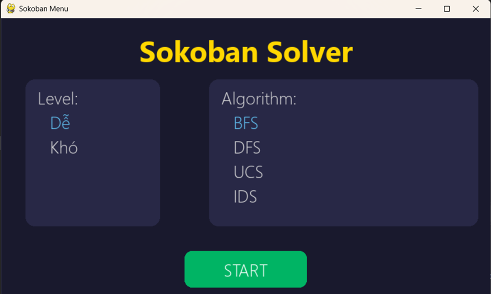
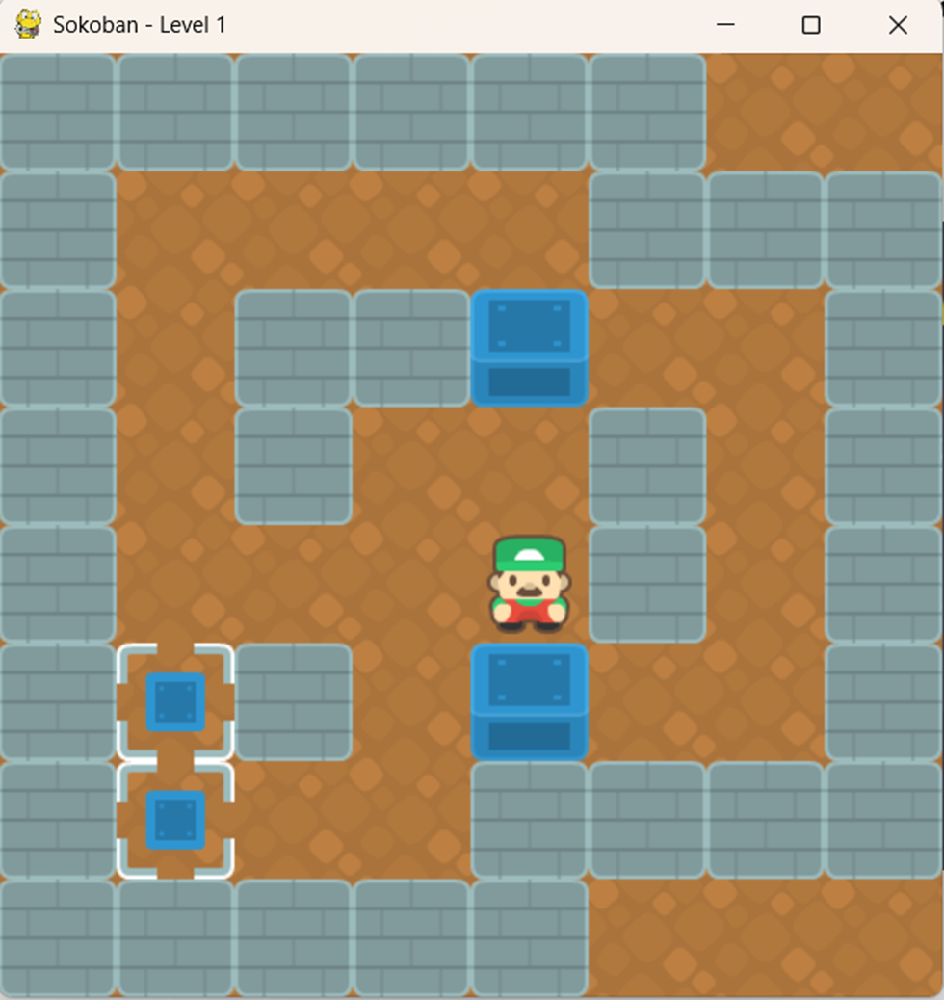
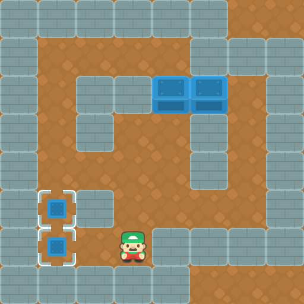
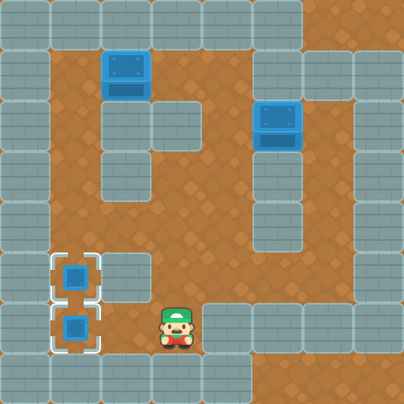

# Cơ sở lý thuyết của thuật toán Search with Partially Observable

## Khái niệm

Đây là phương pháp tìm kiếm trong môi trường mà tác tử không có khả năng quan sát toàn bộ trạng thái hiện tại mà chỉ có thể nhận được thông tin không đầy đủ hoặc bị nhiễu. Điều này khác với No Observable, trong đó trạng thái niềm tin (Belief State) được duy trì để đại diện cho các trạng thái có thể xảy ra.

## Thành phần

- **Tập trạng thái khả dĩ của thế giới (Set of States)**
- **Tập trạng thái niềm tin (Belief State):** tập trạng thái mà agent tin rằng mình thuộc vào đó vì nó không biết chính xác trạng thái thật sự của mình.
- **Trạng thái ban đầu (Initial Belief State(s)):** tập trạng thái mà agent nghĩ mình thuộc về đó.
- **Tập hành động (Actions):** Các hành động mà agent có thể thực hiện.
- **Mô hình chuyển trạng thái (Transition Model):** Xác suất hoặc là tập trạng thái mà agent sẽ chuyển sang khi thực hiện một hành động.
- **Hàm quan sát (Observe):** Xác định những trạng thái quan sát cụ thể sau khi thực hiện một hành động và chuyển đến trạng thái mới.
- **Trạng thái đích:** Tập trạng thái mà agent nghĩ đó là đích.
- **Hàm chi phí**

## Đặc điểm

- **Thông tin không đầy đủ:** Tác tử không biết chính xác mình đang ở trạng thái nào, chỉ có thể suy đoán dựa trên quan sát nhận được.
- **Belief State (Trạng thái niềm tin):** Tác tử duy trì một phân phối xác suất trên tất cả các trạng thái có thể xảy ra để phản ánh kiến thức hiện tại.
- **Hành động cập nhật belief state:** Thực hiện một hành động không chỉ thay đổi trạng thái vật lý mà còn cập nhật trạng thái niềm tin dựa trên mô hình quan sát.
- **Hành động thăm dò (Exploratory actions):** Tác tử có thể cần thực hiện các hành động thăm dò nhằm thu thập thêm thông tin về môi trường.
- **Kế hoạch điều kiện (Contingency Plan):** Kế hoạch được xây dựng dưới dạng phân nhánh, với các nhánh phụ thuộc vào quan sát nhận được sau mỗi hành động.
- **Mô hình hành động và quan sát:** Cần có mô hình xác suất cho cả hành động và quan sát để tính toán trạng thái niềm tin mới.

---

# Sokoban

Sokoban là một trò chơi giải đố nổi tiếng, trong đó người chơi điều khiển một nhân vật đẩy các hộp đến các vị trí đích xác định trong một mê cung.

- **Mục tiêu:** Di chuyển các hộp đến đúng vị trí đích mà không bị kẹt. Người chơi chỉ có thể đẩy (push) chứ không thể kéo (pull) hộp.

## Mô hình

Mỗi trạng thái Node, lưu các thông tin:

- **State:** Ma trận trạng thái hiện tại của Node
- **Parent:** Trạng thái cha
- **Depth:** Độ sâu của cây tìm kiếm
- **Move Direction:** Hướng di chuyển từ cha đến node hiện tại

Trạng thái của trò chơi được mô hình hóa dưới dạng ma trận 2D, với các ký hiệu như:

| Ký hiệu | Ý nghĩa              |
|--------|----------------------|
| `#`    | Tường                |
| `@`    | Người chơi           |
| `$`    | Hộp                  |
| `.`    | Vị trí đích          |
| `*`    | Hộp trên đích        |
| `+`    | Người chơi trên đích |

Các hàm sử dụng

- **Heuristic:** Tổng khoảng cách Manhattan từ mỗi hộp đến vị trí mục tiêu gần nhất.
- **Can_Move(x, y):** Kiểm tra xem người chơi có thể di chuyển vào ô (x, y) không.
- **Copy:** Tạo bản sao trạng thái.
- **Move(player_x, player_y, dx, dy):** Di chuyển sang trạng thái mới.
- **Get_Valid_State:** Lấy danh sách các trạng thái hợp lệ sau khi di chuyển.
- **Check_Win:** Kiểm tra xem tất cả hộp đã vào vị trí mục tiêu chưa?
- **Check_Deadlock:** Kiểm tra deadlock – khi hộp bị kẹt và không di chuyển đến vị trí mục tiêu.

---

## Giao diện

Hình ảnh giao diện chọn độ khó và thuật toán giải quyết

Hình ảnh giao diện khởi chạy quá trình giải bài toán với độ khó và thuật toán được chọn

## Các thuật toán áp dụng

### BFS

#### Perform

#### Evaluation

- **Thời gian thực thi:** 1.86538 giây  
- **Bộ nhớ sử dụng:** 0.27269 MB  
- **Bộ nhớ tối đa:** 24.83519 MB  
- **Số bước thực hiện:** 135  

### A*

#### Perform

#### Evaluation

- **Thời gian thực thi:** 2.54496 giây  
- **Bộ nhớ sử dụng:** 0.28536 MB  
- **Bộ nhớ tối đa:** 24.89012 MB  
- **Số bước thực hiện:** 135  

### Beam Search

#### Perform

#### Evaluation

    - **Thời gian thực thi:** 0.49600 giây  
    - **Bộ nhớ sử dụng:** 0.32198 MB  
    - **Bộ nhớ tối đa:** 4.90529 MB  
    - **Số bước thực hiện:** 175  

### Search with Partially Observable

#### Perform

#### Evaluation

    - **Thời gian thực thi:** 3.70564 giây  
    - **Bộ nhớ sử dụng:** 0.35836 MB  
    - **Bộ nhớ tối đa:** 1.89885 MB  
    - **Số bước thực hiện:** 31  

### Backtracking with Forward Checking

#### Perform

#### Evaluation

    - **Thời gian thực thi:** 1.39077 giây  
    - **Bộ nhớ sử dụng:** 0.50920 MB  
    - **Bộ nhớ tối đa:** 6.53839 MB  
    - **Số bước thực hiện:** 405  

### Q-Learning

#### Perform

#### Evaluation

    - **Thời gian thực thi:** 109.09365 giây  
    - **Bộ nhớ sử dụng:** 0.09008 MB  
    - **Bộ nhớ tối đa:** 0.22181 MB  
    - **Số bước thực hiện:** 88  
